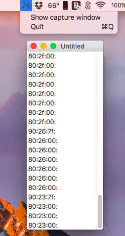

## IP2MIDI

IP2MIDI captures MIDI over Wi-Fi packets and play the corresponding MIDI commands in a Virtual Source instrument using the CoreMIDI framework.

It allows playing on DAWs like GarageBand and Logic Pro X from Android devices that supports MIDI over Wi-Fi.

### Downloads:

[IP2MIDI.app](https://github.com/rraallvv/IP2MIDI/releases/download/1.0/IP2MIDI.zip) - already includes the command line interface.

[ip2midi-cli](https://github.com/rraallvv/IP2MIDI/releases/download/1.0/ip2midi-cli) - command line interface.
